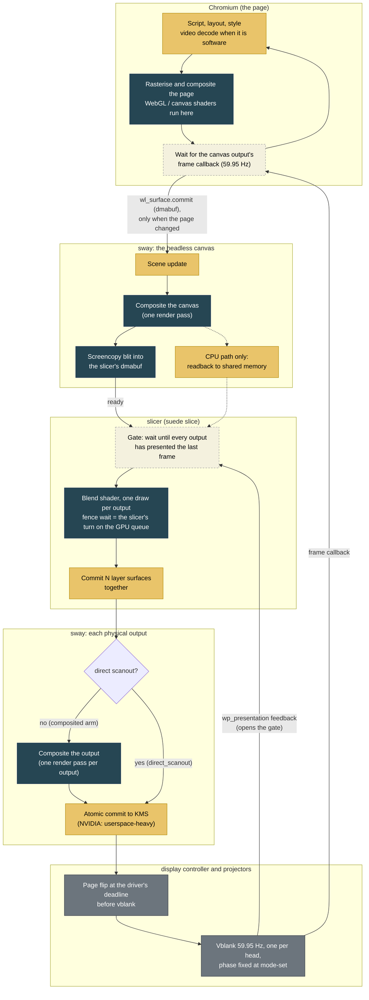
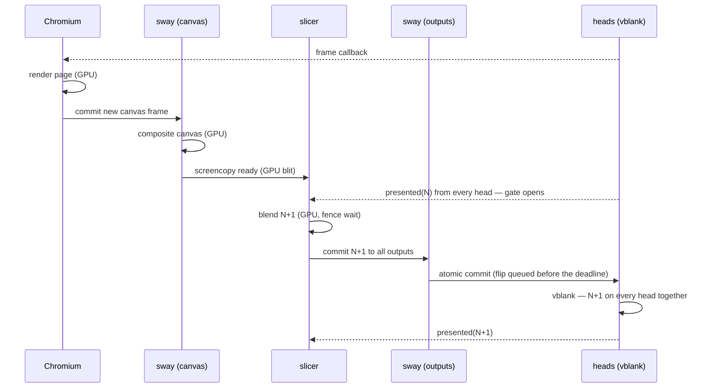

# How it works

Suede's projection path has more moving parts than any one field in the
configuration document can explain: a browser renders once into a headless
canvas, a slicer cuts that canvas into one buffer per projector and blends
the seams, and the compositor puts each buffer on the glass. This page is
the explanation — where a frame comes from and what paces it, where the
blend is actually computed and what it costs, how the displays are kept
showing the same frame at the same instant, and how to compare the two
display paths on the machine in front of you.

It is the companion to the [Configuration reference](configuration.md),
which stays the field reference: what a key means, what values it takes, and
what validation rejects. Everything below describes an appliance that runs
the slicer — [`allow_overlaps = true`](configuration.md#direct-scanout), or
any layout whose outputs overlap. A single output, or a tiling appliance
whose layout does not overlap, skips all of it: sway tiles the layout
directly and no frame takes this path.

## The path of a frame {: #the-path-of-a-frame }

Sway never sees the overlaps. It is always handed a plain edge-to-edge
tiling (sway cannot render overlapping outputs distinctly — its single
global coordinate space gives every output the same pixels in a shared
region, measured on hardware). Instead:

1. The active app renders once into a **headless canvas** the size of the
   layout's bounding box.
2. The **slicer** (`suede slice`, one process per installation) captures the canvas
   each frame, cuts out each projector's configured rectangle — intersecting
   regions are cut into *both* neighbours — applies the gamma-shaped blend
   ramps and black lift per pixel, and presents each slice fullscreen on its
   own output. The loop is damage-driven; a static page costs nothing.

Superimposed on the surface, the two copies of every seam sum to constant
luminance (measured: worst deviation 0.008 across a 160 px seam). The
[`blend`, `gamma` and `blackLift`](configuration.md#projection-edge-blending)
fields shape those ramps; [Where the blend runs](#where-the-blend-runs) is
where the arithmetic happens.

Nothing in this pipeline has a clock of its own except the displays. Every
stage runs when the stage before it hands it something, so the rate at the
end is the rate at the start, minus whatever any stage could not keep up
with. The start is Chromium, and Chromium produces a frame only when the
page changes something: a static page yields nothing, a 25 fps video yields
25, a fullscreen shader yields as many as the GPU can shade. `canvasFps` in
`GET /projection/stats` is that number, and it is the content's rate before
it is anything else.



Dark nodes are GPU work; yellow nodes are CPU work; dashed nodes are waits.
Two things drive the whole loop from the right-hand end: the vblank, which
paces Chromium through the canvas output's frame callback and paces the
slicer through presentation feedback, and the page's own decision to change
something, without which nothing upstream of the gate runs at all.

One cycle in time, on a healthy wall at full rate:



If the commit misses the driver's deadline on any head, that head shows
N+1 one refresh later. Under the frame-callback gate this used to persist
as a standing one-frame offset; under the presentation gate it holds the
next cycle by one refresh instead, counted as a `gateHold`, and the other
heads repeat a frame. Prefer a repeat over a mismatch is the whole rule.

**Where it can stall, and how each looks in the stats.** The cheapest
diagnosis is `presentedFps` against `canvasFps`: equal means every frame the
page made reached every projector, and the question is only whether the
page made enough. From there:

| Bottleneck | When it applies | What the stats show | What helps |
|---|---|---|---|
| **Page is GPU-bound** — a per-pixel shader, WebGL, large CSS effects, at the canvas's full pixel count | Heavy graphics on a small or power-limited GPU (a 50 W RTX A1000 renders a 6.4 Mpx ray-marched shader at about 37 fps) | `canvasFps` below the refresh, GPU utilisation near 100 %, `perFrameMs.waiting` large | Fewer pixels: a smaller canvas, or content that renders its own WebGL at reduced resolution. No launch flag changes shading cost |
| **Page is CPU-bound** — software video decode, heavy script or DOM | Video with no working VA-API (the `video-decode` check warns), script-heavy pages | `canvasFps` low, GPU utilisation low, Chromium processes hot in `top` | Hardware decode, lighter pages |
| **Content cadence** — not a bottleneck | Video at 25 or 30 fps, slideshows, static pages | `canvasFps` equals the content's rate; `waiting` large; nothing else moves | Nothing to fix; a 25 fps source on a 59.95 Hz head also plays with a 2-3-2-3 refresh cadence, which the eye reads as unsteady |
| **Canvas readback** — the CPU/shm capture path | `renderer: cpu`, or `auto` on a compositor without dmabuf capture | `perFrameMs.snapshot` non-zero, `renderer: "cpu"`, ~20 ms per 9 Mpx | The GPU path; it is the default wherever the compositor allows |
| **Blend fence** — the slicer waiting for its turn on a GPU the page is saturating | Any GPU-heavy page, sharing one GPU with the slicer | `perFrameMs.gpu` growing with load (3 ms idle, 5 to 8 ms under a saturating page on the A1000, 40 ms without `CAP_SYS_NICE`). On NVIDIA the wait is not a sleep: the kernel module spins, so the slicer shows 6 % of a core on the sync pattern and 18 % under a saturating page, nearly all of it inside the driver | Realtime queue priority (the package grants it); otherwise the same fix as the first row. Handing the fence to the compositor as an explicit-sync point would move the spin, not remove it |
| **Gate hold** — a head's flip landed late, or the heads are out of phase | After a sway restart on NVIDIA the heads can sit 7 ms apart; a driver that queues a flip late | `gateHolds` and `framesSuperseded` non-zero, `presentedFps` below `canvasFps`, one output's `lagFrames.one` | The `output-phase` fix aligns the heads; a residual hold or two per 600 frames is the gate working |
| **Driver deadline** — commit lands too close to vblank | The blend fence plus commit does not fit inside one refresh after the previous flip | `presentedFps` stepping to half the refresh while `canvasFps` stays higher | Reduce the fence (rows 1 and 5); the gate already commits as early as a flip allows |
| **Per-output compositing** — sway rendering each projector's slice again | The composited arm (`direct_scanout = false`, or the variable set) | `zeroCopyPresented` 0; sway GPU time per output; CPU 1 to 5 % | [`direct_scanout = true`](configuration.md#direct-scanout) on the slicer path removes the pass |
| **Compositor CPU spin** — NVIDIA's EGL library busy-waiting inside sway | GPU-heavy pages on NVIDIA, worse with direct scanout on | sway at 30 to 70 % of a core in `top`, in `libnvidia-eglcore` under `perf`; does not by itself lower fps | Under investigation; a sway renderer other than GLES is the obvious A/B |
| **Head phase and genlock** — the heads' vblanks are not aligned, or not locked | Always, to some degree, without genlock hardware | `phaseMs` non-zero and, if it wanders, `phaseSpreadMs` | A batched mode-set (`output-phase` fix) aligns heads on NVIDIA; nothing in software locks their clocks |

The slicer itself is rarely the limit: its blend is a trivial shader and
its CPU work is a few commits per frame. When the wall is slow, the answer
is almost always in the first two rows or the fence, and the stats say
which.

## Where the blend runs {: #where-the-blend-runs }

The slicer can composite two ways. The CPU path — shared-memory screencopy,
a memcpy snapshot, then the blend on the CPU — is the fallback every
compositor supports. The GPU path keeps every pixel on the GPU instead: the
compositor blits the canvas straight into a Vulkan image the slicer exported
as a dmabuf, a fragment shader blends it into each output's own dmabuf, and
the results are committed as `wl_buffer`s with nothing ever copied to system
memory. Measured on a four-projector rig (RTX A1000, 3840x2385 canvas): the
CPU path ran at 32 fps with the GPU sitting at 38% utilisation — the
compositor's readback of the canvas plus the CPU blend did not fit in one
canvas frame, so the loop took every second one; the GPU path removes both
costs.

[`renderer: "auto"`](configuration.md#projection-edge-blending) (the default) uses
the GPU path when the compositor offers dmabuf capture
(`zwp_linux_dmabuf_v1` version 4, with
`get_default_feedback` completing) and a Vulkan 1.3 driver initialises with
everything the shader needs, falling back to the CPU path — logged, with the
reason — otherwise. `"cpu"` always uses the fallback path. `"gpu"` forces the
GPU path and is a startup error if it is not actually available, so a rig
that must never fall back silently can say so. sway satisfies the GPU path's
requirements on any Mesa driver and on NVIDIA 550 or newer.

`GET /projection/stats` reports which renderer is active, the GPU fence-wait
cost per frame (`perFrameMs.gpu`, zero on the CPU path), and a capture
cadence histogram (`captureIntervals`) counting how many canvas periods
elapsed between successive captures — the direct answer to whether the loop
is keeping up with every canvas frame or only every second one. The web UI's
Projection panel shows all three in the Frame timing block.

The GPU path also negotiates a Vulkan queue priority
(`VK_KHR_global_priority`) — realtime, then high, then medium, whichever the
driver grants — so the blend can pre-empt a GPU-heavy app on the same device
instead of queuing behind it. The package grants the capability this needs
(`cap_sys_nice+ep` on `/usr/bin/suede`) at install time, reapplied on every
upgrade. `GET /projection/stats` does not report which tier is active; the
slicer's startup log line does, as `queue priority realtime|high|medium`. On
a machine that installed the binary another way, grant it by hand and
restart the service:

```bash
sudo setcap cap_sys_nice+ep /usr/bin/suede
systemctl --user restart suede.service
```

**Blending is a ramp in light, not in signal.** A display raises its input
signal to a power (its gamma, typically 2.2), so a gradient linear in signal
leaves a bright band at every seam. Ramps are shaped as `ramp^(1/gamma)`.

**Black-level compensation.** Projector black is not zero light, so seams
glow on dark scenes. The extra light cannot be removed, so `blackLift`
brightens everything else to match: `out = lift + (1 - lift) * in`. That is a
linear remap of the *whole* range — black rises to `lift`, white stays white,
and the contrast lost is spread across the palette rather than clipped off
the top.

Set it to the lift that adds **one projector's** worth of black; Suede scales
it to each region. A point lit by `n` projectors sits at `n` times one
projector's black, so with `N` the most projectors covering any point of the
layout, each of the `n` applies `lift × (N − n) / n` — the shortfall, shared
between the projectors that light it. Two projectors give the familiar rule
(full lift outside the seam, none inside). A 2×2 grid has three floors, and
all three are matched: the four-way centre gets nothing, the two-way seams
`lift`, and single-covered regions `3 × lift`.

Show the [`black` test pattern](configuration.md#projection-test-patterns) and
raise it until the projected image is even.

## Keeping the displays in step {: #keeping-the-displays-in-step }

Two outputs mode-set at different rates drift apart: at 60.000 Hz and
59.939 Hz they are a whole frame out of step roughly every 16 seconds, and a
camera with a fast enough shutter catches it — one display's frame counter
running one ahead of the other's, for the fraction of a second it takes the
slower one to catch up. The [`refresh-rates` health
check](configuration.md#refresh-rates) warns whenever the active displays are
not all running at the same rate, and names a rate they
all advertise when one exists. This is the case it was written for: on the
rig where it was first noticed, both projectors advertised 60 Hz and
59.94 Hz, and the configuration had simply picked one of each.

Even with both outputs mode-set to the same rate, a fast shutter always
catches a window of up to one frame where one output has flipped to the next
buffer and the other has not. Outputs on a GPU without genlock hardware have
independent vblank phase, fixed the moment the mode is set, and nothing
running above the display controller can close that gap — it is inherent to
any computer driving more than one display, not a bug in this one.

What the slicer does about it: it commits a frame to every output together,
and does not commit the next one until every output has reported that the
previous frame reached the glass — the compositor's own `wp_presentation`
feedback, which is the page flip itself. Anchoring to the flip is what makes
the timing work: every commit then goes out just after a vblank, as far from
the next deadline as a commit can be, so each frame has a whole refresh
period in which to be rendered and flipped rather than a sliver of one. A
head whose flip does land a refresh late holds the gate for that refresh and
the other outputs repeat a frame — which is the trade on purpose, a repeat
on every display being better than a mismatch between them. The canvas keeps
rendering on its own clock regardless; whatever is newest when the gate opens
is what gets shown, dropped or repeated identically on every output when the
two clocks beat against each other. An output that reports nothing for 300 ms
is dropped from the gate, so a display that has gone to sleep cannot freeze
the rest of the wall — and it counts as a stall.

The gate used to wait on `wl_surface.frame` callbacks instead, and that was
not enough. wlroots sends a frame callback when it *commits* an output's
frame, before the flip lands, so a head whose flip misses the driver's
deadline and lands a vblank late answers on time and the gate opens anyway.
Measured on a three-projector NVIDIA rig with the [`sync` test
pattern](configuration.md#projection-test-patterns): every output presented
every frame at 60 Hz — 600 presented apiece, no discards,
no stalls — while `wp_presentation` reported the outputs a full refresh
period apart, steadily, for 30 to 60 seconds at a stretch, on both the
composited and the direct-scanout path. Every output taking every frame while
one of them is a whole frame behind is the signature of a gate watching the
wrong event. Where a compositor offers no `wp_presentation` at all the slicer
still falls back to frame callbacks, since pacing on the earlier signal beats
not pacing.

[`freeRun`](configuration.md#projection-edge-blending) turns the gate off: each
output takes the newest available frame the moment it is ready, independently
of the others. It exists for
installations that cannot be brought to a shared rate; the trade is that the
wall stops being in step, in exchange for every output running as smoothly
as it can on its own.

The canvas output itself is given the participating outputs' refresh rate —
the fastest of them, when they differ, since a canvas slower than an output
would starve it.

Measuring it: `GET /projection/stats` (and the `projection_stats_changed`
event) report the inter-output presentation offset (mean/max milliseconds,
read from `wp_presentation`), straddles (frames the outputs showed on
different refreshes), gate holds, superseded frames, stalls, and per-output
presented/discarded counts, zero-copy presented count, and measured refresh,
alongside the canvas and presented frame rates and the per-frame cost
breakdown. The web UI shows all of this in the Projection panel. A non-zero
`zeroCopyPresented` proves the compositor scanned that output's buffer
straight out to the display controller for at least one frame this interval,
with no compositing pass in between. A steady offset of a few milliseconds with
zero straddles is what a healthy wall looks like; straddles that rise over
time mean commits are landing between two outputs' renders. `gateHolds`
counts the commit cycles the wall delayed past a canvas period waiting for an
output that had not yet reported presenting the previous frame: zero on a
healthy wall, where every output's feedback is back well before the next
frame is due, and a rising count when one head's flips are landing a refresh
later than the rest. It is the price of staying together, not a fault —
each hold is one frame repeated identically on every output — so read it
beside `straddles`, which is what the holds are buying. Each output's
`phaseMs` is its vblank phase relative to the first output, circular-mean'd
over the interval: a value that stays put from one report to the next means
the two heads are locked at a fixed offset (a synchronised mode-set could
align them), while one that wanders means independent clocks that only
hardware sync can fix. Each output's `lagFrames` is a histogram
(`zero`/`one`/`two`/`more`) of how many whole refresh periods behind the
earliest presenting output that output landed, per snapshot with at least two
presenters — built purely from `wp_presentation` timestamps, i.e. the flip,
so a display's own processing latency after the flip is invisible to it. Read
it against a photograph: a camera showing an output visibly behind while its
`lagFrames` reads all-zero means the lag lives in the display, not the
presentation path; non-zero `one`/`two`/`more` counts on that output mean the
presentation path itself is delivering it a stale frame.

The `output-phase` health check reads exactly that field and warns when any
output is more than 1.0 ms from the first. It was written from a
measurement on a four-projector NVIDIA rig (RTX A1000, sway 1.10.1): outputs
enabled one `output … enable` at a time left the first head 7.1 ms out of
phase with the other three, which locked to each other — about 145
straddled frames per 330 captured. The same four, disabled and then
re-enabled together in one sway IPC message, landed within 0.03 ms of each
other — about 20 straddles per 330 at the same rate. A mode-set delivered in
one IPC message is applied by sway in one backend commit, which is what
keeps the heads on the same clock; one command per output, even issued back
to back, is not. Treat that as NVIDIA behaviour rather than a guarantee: the
same batched re-enable on a Raspberry Pi 5's Broadcom driver narrowed a
7.5 ms difference to 4.5 ms without closing it, so on hardware that does not
lock its heads this way the check can still warn after its own fix has run.
Suede's reconciler always batches an output plan's commands into one message
for exactly this reason (including its first application after the daemon
starts), so a fresh boot should already show the outputs in phase — this
check exists for the drift a hotplug or a partial reconfiguration can still
introduce.

Its fix disables every active display, waits about a second and a half for
sway to actually tear them down, and re-enables and fully reconfigures them
together in that same single IPC message. The wall goes dark for the
duration — there is no way to move every output to a new phase without
letting each one restart its raster, and that means going through
"nothing showing" — so run it between shows, not during one. The check
itself only re-measures on the slicer's own ten-second interval, so the
result shows up on the next report after the fix, not immediately.

## Comparing the two {: #comparing-the-two }

With [`allow_overlaps = true`](configuration.md#direct-scanout), flipping
`direct_scanout` and restarting sway switches between a flipped and a
composited wall while nothing else about the machine changes. Show the `sync`
test pattern (see [Test patterns](configuration.md#projection-test-patterns))
so the measurement is of the presentation path alone, let it settle, then read
`GET /projection/stats` under each arm and compare:

| What to read | Scanned out | Composited |
|---|---|---|
| `zeroCopyPresented` vs `presented`, per output | every frame, or the buffers are not being flipped at all | zero, always |
| `straddles` | outputs showing one frame on different refreshes | same — a difference here is the flip's timing, not the blend |
| `lagFrames`, per output | which display is behind, and by how many whole frames | same, and a lag that survives both arms is the display, not Suede |
| compositor CPU (`ps -o %cpu` on sway) | one full-screen pass per output per frame less — in principle | the baseline to beat |

A `zeroCopyPresented` of zero while `direct_scanout` is true means the
compositor refused to flip: the buffer is the wrong size or format for the
display controller, the output is scaled, or the variable is still set
somewhere. Check the `direct-scanout` health check first — it compares the
running compositor against these keys and says which way they disagree.
