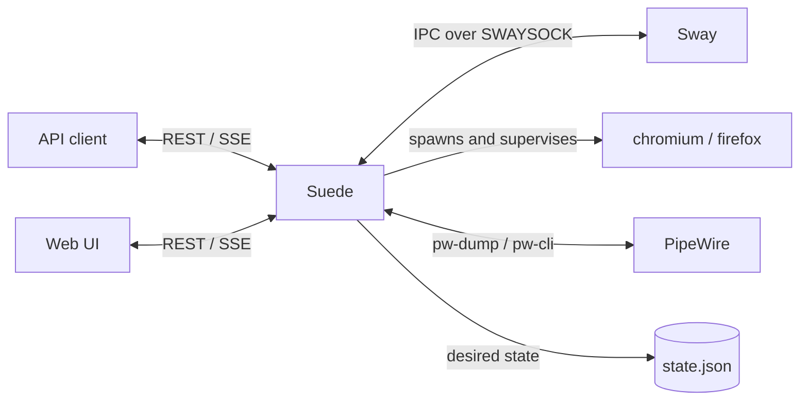

# Suede

Suede is a daemon with a name that is a hilarious pun on the word "Swayed". It turns a Linux box running [Sway](https://swaywm.org/) into a remotely manageable display appliance.

You describe the state you want — which displays are on, at what mode and position, which browsers show which pages, where their audio goes — and Suede keeps reality matching it. Through reboots, display hotplugs, and application crashes, with no operator on site.

<div class="grid cards" markdown>

-   :material-monitor-multiple:{ .lg .middle } **Full output control**

    Mode, position, scale, transform, adaptive sync, tearing, and max render time per display, with live enumeration of what is connected and what modes it advertises.

-   :material-web:{ .lg .middle } **Kiosk browser supervision**

    One application at a time covering every display as a single canvas, with battle-tested kiosk arguments, per-app browser profiles, readiness gating, and crash-restart with backoff.

-   :material-volume-high:{ .lg .middle } **Audio routing**

    Enumerate PipeWire sinks with identifiers that survive reboots, route each application to a chosen sink, or silence it entirely.

-   :material-heart-pulse:{ .lg .middle } **Content watchdog**

    Pages post heartbeats. A frozen page gets its browser killed and relaunched — process liveness alone would never notice.

</div>

## The idea

Most remote display management is imperative: you send commands, and whatever state results is whatever state you happen to have left behind. Suede is declarative instead. Clients write a **desired-state document**; a reconciler continuously drives the live Sway session toward it.

That one decision is why the awkward cases are not special cases:

| Situation | What happens |
|---|---|
| An operator edits the configuration | The document changes; a pass runs |
| The machine reboots | The document is loaded; a pass runs |
| A display is unplugged and replugged | Sway emits an event; a pass runs |
| A browser crashes | The supervisor notices; a pass runs |

There is no boot-restore code path, no hotplug-recovery code path. There is one pass.

## The shape of it



Observed state — what Sway and PipeWire report — is always re-derived and never persisted. Desired state is the only thing written to disk.

## Getting started

```bash
sudo apt install ./suede_*_arm64.deb
sudo /usr/share/suede/provision.sh
sudo reboot
```

Then open `http://<machine>:9088/` from another computer. The bundled web UI walks you through anything still missing.

[Full installation guide :material-arrow-right:](getting-started.md){ .md-button .md-button--primary }
[Configuration reference :material-arrow-right:](configuration.md){ .md-button }

## Where it came from

Suede generalizes a production system built for a television studio, where a Raspberry Pi drove multi-display game graphics through Sway's IPC socket. That service worked, but it was welded to one application. Suede is the same idea with the specifics removed: a documented API, persisted state, and no assumptions about what you are putting on the screens.
